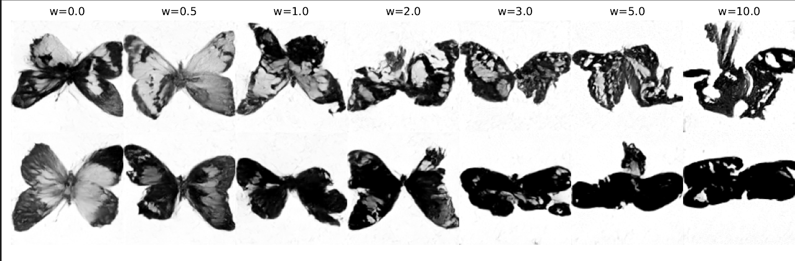

# Flow-Matching for Generative Medical Imaging

This project was realized during a research internship at TUM Bioinformatics Professorship (BIT) as part of my
M.Sc. Chemical Biotechnology degree. 

The goal was to implement, train and evaluate Flow-Matching and Diffusion (Probabilistic) Models using U-Net and 
VisionTransformer architectures. Both were used for un- and conditional synthesis of MRI images via Classifier Free
Guidance.

The models were trained on the [Brain Tumor MRI Dataset](https://doi.org/10.34740/KAGGLE/DSV/2645886) and [Smithsionian
Butterflies](https://huggingface.co/datasets/ceyda/smithsonian_butterflies) for additional validation.

## Results
- Flow-Matching Models outperform DDPMs in terms of sample quality and inference time. The former generates images
containing fewer aberrations and artifacts. 
- Regardless of model class, U-Net outperforms ViT and enables the network to 
generate images of higher quality. 
- The ViT was incapable of training on the preprocessed Smithsonian Butterflies Dataset as it contained a small number 
of training samples.
- Increasing the guidance scale to extremely high values yields highly saturated and distorted samples (as can seen below): 

## References & Acknowledgements
The Flow-Matching code was heavily inspired by [MIT's 6.S184 (2025)](https://diffusion.csail.mit.edu/) course.
- [MRI Dataset](https://doi.org/10.34740/KAGGLE/DSV/2645886)
- [Smithsonian Butterflies Dataset](https://huggingface.co/datasets/huggan/smithsonian_butterflies_subset)
- [Denoising Diffusion Probabilistic Models paper](https://arxiv.org/abs/2006.11239) and 
[code](https://github.com/hojonathanho/diffusion)
- [Flow-Matching Guide and Code paper](https://arxiv.org/abs/2412.06264) and
[code](https://github.com/facebookresearch/flow_matching)
